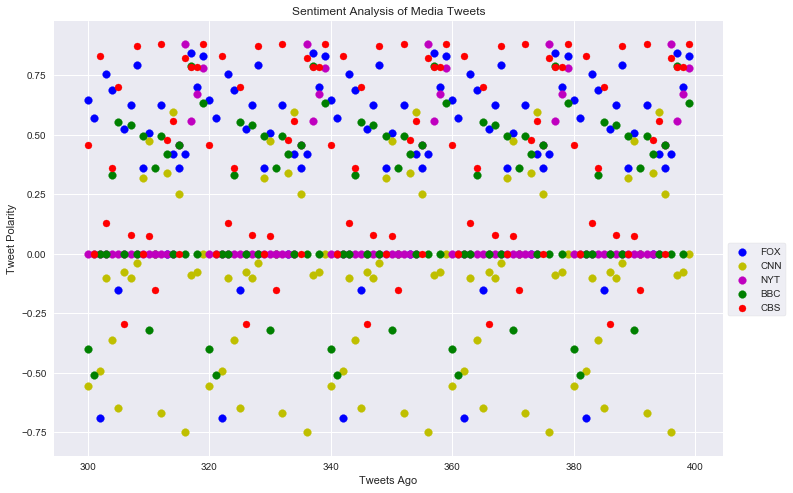
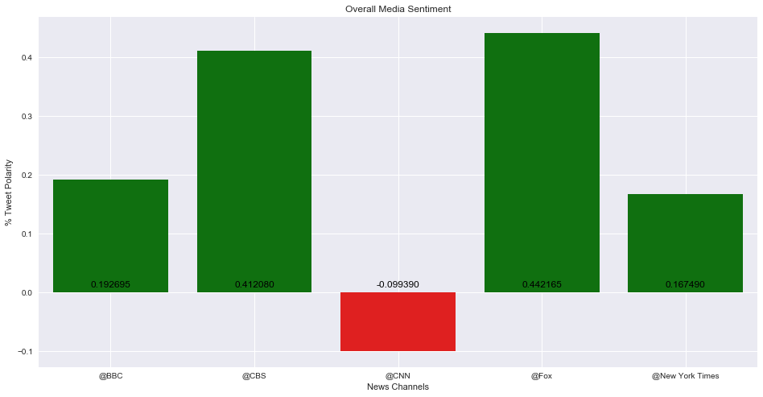

# News Mood

- #### Review of last 100 Tweets by top news outlets shows FOX tweets have considerably higher compound sentiment score than Others. (Results obtained utilizing Vader Sentiment Analyzer).

- #### CNN has the low compound sentiment score.

- #### Needs to analyze more to get specific details 


```python
# Dependencies
import tweepy
import json
import pandas as pd
import numpy as np
import matplotlib.pyplot as plt
from datetime import datetime
import random as r 
import seaborn as sn
from math import trunc

# Import and Initialize Sentiment Analyzer
from vaderSentiment.vaderSentiment import SentimentIntensityAnalyzer
analyzer = SentimentIntensityAnalyzer()
```


```python
# Twitter API Keys
consumer_key = "c8iPOfqAcm1qys97q3RW0wKOM"
consumer_secret = "6sUoqS7FtJkIKTfdoWaZHEf5quOEeqAfrJLsSJMzJd2Aw1myoF"
access_token = "229598666-EnGXtgqnFXT8zjHrMTI7medln9PlPdT5thbQhjJh"
access_token_secret = "Bdr3ujJgJqgf6wksE2b8OQ7CxkFTCAi5KolqLZrc9giNH"
```


```python
# Setup Tweepy API Authentication
auth = tweepy.OAuthHandler(consumer_key, consumer_secret)
auth.set_access_token(access_token, access_token_secret)
api = tweepy.API(auth, parser=tweepy.parsers.JSONParser())
```


```python
# Target User Accounts
target_user = ('@BBC', '@CBS', '@CNN', '@Fox', '@New York Times')
#target_user = ('@CNN')
```


```python
# A list to hold tweet timestamps
tweet_times = []
user_list = []
compound_list = []
positive_list = []
negative_list = []
neutral_list = []
time_list = []
my_index = []

# Loop through each user
for user in target_user:
    idx = 0
    # Loop through 10 pages of tweets (total 200 tweets)
    for x in range(5):
        public_tweets = api.user_timeline(user)
        
        # Loop through all tweets
        for tweet in public_tweets:

            # Run Vader Analysis on each tweet
            compound = analyzer.polarity_scores(tweet["text"])["compound"]
            pos = analyzer.polarity_scores(tweet["text"])["pos"]
            neu = analyzer.polarity_scores(tweet["text"])["neu"]
            neg = analyzer.polarity_scores(tweet["text"])["neg"]
            
            # Add each value to the appropriate array
            user_list.append(user)
            compound_list.append(compound)
            positive_list.append(pos)
            negative_list.append(neg)
            neutral_list.append(neu)
            my_index.append(idx)
            idx +=1

# Adding all the tweets into an Array

news_data = pd.DataFrame({'Agency': user_list, 'Compound': compound_list,'Positive': positive_list,
                            'Neutral':neutral_list,'Negative':negative_list,
                         'My_index':my_index
                         })
news_data.set_index('My_index')
```


<div>
<style>
    .dataframe thead tr:only-child th {
        text-align: right;
    }

    .dataframe thead th {
        text-align: left;
    }

    .dataframe tbody tr th {
        vertical-align: top;
    }
</style>
<table border="1" class="dataframe">
  <thead>
    <tr style="text-align: right;">
      <th></th>
      <th>Agency</th>
      <th>Compound</th>
      <th>Negative</th>
      <th>Neutral</th>
      <th>Positive</th>
    </tr>
    <tr>
      <th>My_index</th>
      <th></th>
      <th></th>
      <th></th>
      <th></th>
      <th></th>
    </tr>
  </thead>
  <tbody>
    <tr>
      <th>0</th>
      <td>@BBC</td>
      <td>-0.4007</td>
      <td>0.114</td>
      <td>0.886</td>
      <td>0.000</td>
    </tr>
    <tr>
      <th>1</th>
      <td>@BBC</td>
      <td>-0.5106</td>
      <td>0.148</td>
      <td>0.852</td>
      <td>0.000</td>
    </tr>
    <tr>
      <th>2</th>
      <td>@BBC</td>
      <td>0.0000</td>
      <td>0.000</td>
      <td>1.000</td>
      <td>0.000</td>
    </tr>
    <tr>
      <th>3</th>
      <td>@BBC</td>
      <td>0.0000</td>
      <td>0.000</td>
      <td>1.000</td>
      <td>0.000</td>
    </tr>
    <tr>
      <th>4</th>
      <td>@BBC</td>
      <td>0.3327</td>
      <td>0.000</td>
      <td>0.894</td>
      <td>0.106</td>
    </tr>
    <tr>
      <th>5</th>
      <td>@BBC</td>
      <td>0.5562</td>
      <td>0.000</td>
      <td>0.805</td>
      <td>0.195</td>
    </tr>
    <tr>
      <th>6</th>
      <td>@BBC</td>
      <td>0.0000</td>
      <td>0.000</td>
      <td>1.000</td>
      <td>0.000</td>
    </tr>
    <tr>
      <th>7</th>
      <td>@BBC</td>
      <td>0.5399</td>
      <td>0.000</td>
      <td>0.812</td>
      <td>0.188</td>
    </tr>
    <tr>
      <th>8</th>
      <td>@BBC</td>
      <td>0.0000</td>
      <td>0.000</td>
      <td>1.000</td>
      <td>0.000</td>
    </tr>
    <tr>
      <th>9</th>
      <td>@BBC</td>
      <td>0.4939</td>
      <td>0.000</td>
      <td>0.849</td>
      <td>0.151</td>
    </tr>
    <tr>
      <th>10</th>
      <td>@BBC</td>
      <td>-0.3182</td>
      <td>0.141</td>
      <td>0.859</td>
      <td>0.000</td>
    </tr>
    <tr>
      <th>11</th>
      <td>@BBC</td>
      <td>0.3612</td>
      <td>0.000</td>
      <td>0.872</td>
      <td>0.128</td>
    </tr>
    <tr>
      <th>12</th>
      <td>@BBC</td>
      <td>0.4939</td>
      <td>0.000</td>
      <td>0.814</td>
      <td>0.186</td>
    </tr>
    <tr>
      <th>13</th>
      <td>@BBC</td>
      <td>0.4215</td>
      <td>0.000</td>
      <td>0.865</td>
      <td>0.135</td>
    </tr>
    <tr>
      <th>14</th>
      <td>@BBC</td>
      <td>0.0000</td>
      <td>0.000</td>
      <td>1.000</td>
      <td>0.000</td>
    </tr>
    <tr>
      <th>15</th>
      <td>@BBC</td>
      <td>0.4574</td>
      <td>0.000</td>
      <td>0.857</td>
      <td>0.143</td>
    </tr>
    <tr>
      <th>16</th>
      <td>@BBC</td>
      <td>0.0000</td>
      <td>0.000</td>
      <td>1.000</td>
      <td>0.000</td>
    </tr>
    <tr>
      <th>17</th>
      <td>@BBC</td>
      <td>0.7906</td>
      <td>0.000</td>
      <td>0.696</td>
      <td>0.304</td>
    </tr>
    <tr>
      <th>18</th>
      <td>@BBC</td>
      <td>0.0000</td>
      <td>0.000</td>
      <td>1.000</td>
      <td>0.000</td>
    </tr>
    <tr>
      <th>19</th>
      <td>@BBC</td>
      <td>0.6361</td>
      <td>0.000</td>
      <td>0.792</td>
      <td>0.208</td>
    </tr>
    <tr>
      <th>20</th>
      <td>@BBC</td>
      <td>-0.4007</td>
      <td>0.114</td>
      <td>0.886</td>
      <td>0.000</td>
    </tr>
    <tr>
      <th>21</th>
      <td>@BBC</td>
      <td>-0.5106</td>
      <td>0.148</td>
      <td>0.852</td>
      <td>0.000</td>
    </tr>
    <tr>
      <th>22</th>
      <td>@BBC</td>
      <td>0.0000</td>
      <td>0.000</td>
      <td>1.000</td>
      <td>0.000</td>
    </tr>
    <tr>
      <th>23</th>
      <td>@BBC</td>
      <td>0.0000</td>
      <td>0.000</td>
      <td>1.000</td>
      <td>0.000</td>
    </tr>
    <tr>
      <th>24</th>
      <td>@BBC</td>
      <td>0.3327</td>
      <td>0.000</td>
      <td>0.894</td>
      <td>0.106</td>
    </tr>
    <tr>
      <th>25</th>
      <td>@BBC</td>
      <td>0.5562</td>
      <td>0.000</td>
      <td>0.805</td>
      <td>0.195</td>
    </tr>
    <tr>
      <th>26</th>
      <td>@BBC</td>
      <td>0.0000</td>
      <td>0.000</td>
      <td>1.000</td>
      <td>0.000</td>
    </tr>
    <tr>
      <th>27</th>
      <td>@BBC</td>
      <td>0.5399</td>
      <td>0.000</td>
      <td>0.812</td>
      <td>0.188</td>
    </tr>
    <tr>
      <th>28</th>
      <td>@BBC</td>
      <td>0.0000</td>
      <td>0.000</td>
      <td>1.000</td>
      <td>0.000</td>
    </tr>
    <tr>
      <th>29</th>
      <td>@BBC</td>
      <td>0.4939</td>
      <td>0.000</td>
      <td>0.849</td>
      <td>0.151</td>
    </tr>
    <tr>
      <th>...</th>
      <td>...</td>
      <td>...</td>
      <td>...</td>
      <td>...</td>
      <td>...</td>
    </tr>
    <tr>
      <th>70</th>
      <td>@New York Times</td>
      <td>0.0000</td>
      <td>0.000</td>
      <td>1.000</td>
      <td>0.000</td>
    </tr>
    <tr>
      <th>71</th>
      <td>@New York Times</td>
      <td>0.0000</td>
      <td>0.000</td>
      <td>1.000</td>
      <td>0.000</td>
    </tr>
    <tr>
      <th>72</th>
      <td>@New York Times</td>
      <td>0.0000</td>
      <td>0.000</td>
      <td>1.000</td>
      <td>0.000</td>
    </tr>
    <tr>
      <th>73</th>
      <td>@New York Times</td>
      <td>0.0000</td>
      <td>0.000</td>
      <td>1.000</td>
      <td>0.000</td>
    </tr>
    <tr>
      <th>74</th>
      <td>@New York Times</td>
      <td>0.0000</td>
      <td>0.000</td>
      <td>1.000</td>
      <td>0.000</td>
    </tr>
    <tr>
      <th>75</th>
      <td>@New York Times</td>
      <td>0.4588</td>
      <td>0.000</td>
      <td>0.250</td>
      <td>0.750</td>
    </tr>
    <tr>
      <th>76</th>
      <td>@New York Times</td>
      <td>0.8807</td>
      <td>0.000</td>
      <td>0.595</td>
      <td>0.405</td>
    </tr>
    <tr>
      <th>77</th>
      <td>@New York Times</td>
      <td>0.5574</td>
      <td>0.000</td>
      <td>0.783</td>
      <td>0.217</td>
    </tr>
    <tr>
      <th>78</th>
      <td>@New York Times</td>
      <td>0.6705</td>
      <td>0.000</td>
      <td>0.476</td>
      <td>0.524</td>
    </tr>
    <tr>
      <th>79</th>
      <td>@New York Times</td>
      <td>0.7824</td>
      <td>0.000</td>
      <td>0.623</td>
      <td>0.377</td>
    </tr>
    <tr>
      <th>80</th>
      <td>@New York Times</td>
      <td>0.0000</td>
      <td>0.000</td>
      <td>1.000</td>
      <td>0.000</td>
    </tr>
    <tr>
      <th>81</th>
      <td>@New York Times</td>
      <td>0.0000</td>
      <td>0.000</td>
      <td>1.000</td>
      <td>0.000</td>
    </tr>
    <tr>
      <th>82</th>
      <td>@New York Times</td>
      <td>0.0000</td>
      <td>0.000</td>
      <td>1.000</td>
      <td>0.000</td>
    </tr>
    <tr>
      <th>83</th>
      <td>@New York Times</td>
      <td>0.0000</td>
      <td>0.000</td>
      <td>1.000</td>
      <td>0.000</td>
    </tr>
    <tr>
      <th>84</th>
      <td>@New York Times</td>
      <td>0.0000</td>
      <td>0.000</td>
      <td>1.000</td>
      <td>0.000</td>
    </tr>
    <tr>
      <th>85</th>
      <td>@New York Times</td>
      <td>0.0000</td>
      <td>0.000</td>
      <td>1.000</td>
      <td>0.000</td>
    </tr>
    <tr>
      <th>86</th>
      <td>@New York Times</td>
      <td>0.0000</td>
      <td>0.000</td>
      <td>1.000</td>
      <td>0.000</td>
    </tr>
    <tr>
      <th>87</th>
      <td>@New York Times</td>
      <td>0.0000</td>
      <td>0.000</td>
      <td>1.000</td>
      <td>0.000</td>
    </tr>
    <tr>
      <th>88</th>
      <td>@New York Times</td>
      <td>0.0000</td>
      <td>0.000</td>
      <td>1.000</td>
      <td>0.000</td>
    </tr>
    <tr>
      <th>89</th>
      <td>@New York Times</td>
      <td>0.0000</td>
      <td>0.000</td>
      <td>1.000</td>
      <td>0.000</td>
    </tr>
    <tr>
      <th>90</th>
      <td>@New York Times</td>
      <td>0.0000</td>
      <td>0.000</td>
      <td>1.000</td>
      <td>0.000</td>
    </tr>
    <tr>
      <th>91</th>
      <td>@New York Times</td>
      <td>0.0000</td>
      <td>0.000</td>
      <td>1.000</td>
      <td>0.000</td>
    </tr>
    <tr>
      <th>92</th>
      <td>@New York Times</td>
      <td>0.0000</td>
      <td>0.000</td>
      <td>1.000</td>
      <td>0.000</td>
    </tr>
    <tr>
      <th>93</th>
      <td>@New York Times</td>
      <td>0.0000</td>
      <td>0.000</td>
      <td>1.000</td>
      <td>0.000</td>
    </tr>
    <tr>
      <th>94</th>
      <td>@New York Times</td>
      <td>0.0000</td>
      <td>0.000</td>
      <td>1.000</td>
      <td>0.000</td>
    </tr>
    <tr>
      <th>95</th>
      <td>@New York Times</td>
      <td>0.4588</td>
      <td>0.000</td>
      <td>0.250</td>
      <td>0.750</td>
    </tr>
    <tr>
      <th>96</th>
      <td>@New York Times</td>
      <td>0.8807</td>
      <td>0.000</td>
      <td>0.595</td>
      <td>0.405</td>
    </tr>
    <tr>
      <th>97</th>
      <td>@New York Times</td>
      <td>0.5574</td>
      <td>0.000</td>
      <td>0.783</td>
      <td>0.217</td>
    </tr>
    <tr>
      <th>98</th>
      <td>@New York Times</td>
      <td>0.6705</td>
      <td>0.000</td>
      <td>0.476</td>
      <td>0.524</td>
    </tr>
    <tr>
      <th>99</th>
      <td>@New York Times</td>
      <td>0.7824</td>
      <td>0.000</td>
      <td>0.623</td>
      <td>0.377</td>
    </tr>
  </tbody>
</table>
<p>500 rows × 5 columns</p>
</div>


```python
news_data['Agency'].unique()
```


    array(['@BBC', '@CBS', '@CNN', '@Fox', '@New York Times'], dtype=object)


```python
plt.figure(figsize=(12,8))
numbers = news_data[news_data['Agency'] == '@Fox'].index
plt.scatter(numbers, news_data[news_data['Agency']=='@Fox']['Compound'],  marker ='o', color='b', s=60, label = 'FOX')
plt.scatter(numbers,news_data[news_data['Agency']=='@CNN']['Compound'],  marker ='o', color='y', s=60, label = 'CNN')
plt.scatter(numbers, news_data[news_data['Agency']=='@New York Times']['Compound'], marker ='o', s=60, color='m', label = 'NYT')
plt.scatter(numbers,news_data[news_data['Agency']=='@BBC']['Compound'], marker ='o', s = 60, color='g', label = 'BBC')
plt.scatter(numbers,news_data[news_data['Agency']=='@CBS']['Compound'], marker ='o', color='r', label = 'CBS')
plt.gca().set(xlabel = 'Tweets Ago', ylabel = 'Tweet Polarity',title = 'Sentiment Analysis of Media Tweets')
plt.legend(loc = 'best',bbox_to_anchor=(1, 0.5), frameon=True)

plt.show()


```





```python
Compound_percentage =  news_data.groupby('Agency').mean()['Compound'].to_frame("% Compound")
Compound_percentage
```


<div>
<style>
    .dataframe thead tr:only-child th {
        text-align: right;
    }

    .dataframe thead th {
        text-align: left;
    }

    .dataframe tbody tr th {
        vertical-align: top;
    }
</style>
<table border="1" class="dataframe">
  <thead>
    <tr style="text-align: right;">
      <th></th>
      <th>% Compound</th>
    </tr>
    <tr>
      <th>Agency</th>
      <th></th>
    </tr>
  </thead>
  <tbody>
    <tr>
      <th>@BBC</th>
      <td>0.192695</td>
    </tr>
    <tr>
      <th>@CBS</th>
      <td>0.412080</td>
    </tr>
    <tr>
      <th>@CNN</th>
      <td>-0.099390</td>
    </tr>
    <tr>
      <th>@Fox</th>
      <td>0.442165</td>
    </tr>
    <tr>
      <th>@New York Times</th>
      <td>0.167490</td>
    </tr>
  </tbody>
</table>
</div>


```python
x=Compound_percentage.index
y=Compound_percentage['% Compound']
plt.figure(figsize=(16,8))
colors = ['green' if _y >=0.0 else 'red' for _y in y]
ax = sn.barplot(x, y, palette=colors)
for n, (label, _y) in enumerate(zip(x, y)):
    if _y <= 0.0:
        ax.annotate(
            s='{:f}'.format(_y), xy=(n, -0), ha='center',va='center',
            xytext=(0,10), color='k', textcoords='offset points')
    else:
        ax.annotate(
            s='{:f}'.format(_y), xy=(n, 0), ha='center',va='center',
            xytext=(0,10), color='k', textcoords='offset points')  
plt.gca().set(xlabel='News Channels', ylabel='% Tweet Polarity', title='Overall Media Sentiment')
plt.rc('grid', linestyle="--", color='black', linewidth=0.5)
plt.grid(True)
plt.show()
```





```python

```
